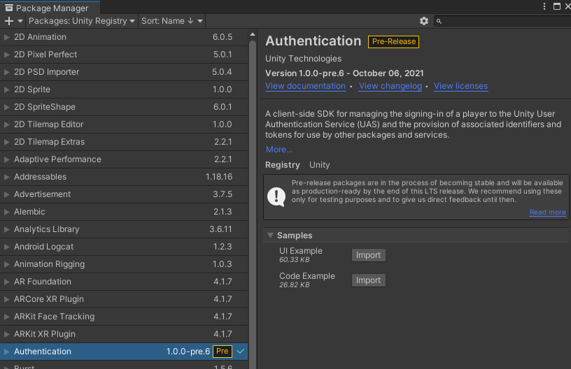

# Authentication Sample

## Installation

1) Create a new Unity project and install the package, see [Installation](Installation.md) for details.

2) Install the __Authentication Samples__ from the package manager window by clicking the __Import__ button next to _UI Example_ and _Code Example_.

   
   
3) __Link the project__ using the steps in the [Setup Guide](QuickStartGuide.md)

3) Open the __AnonymousLoginUIExample__ Unity scene located in __Assets/Samples/Authentication/*version*/UI Example/__ 
   
   The *version* number will depend on the package version.

4) Play the scene in the editor

For the __FacebookLoginUIExample__ scene the game developer will need to provide a valid access token from facebook.

 

